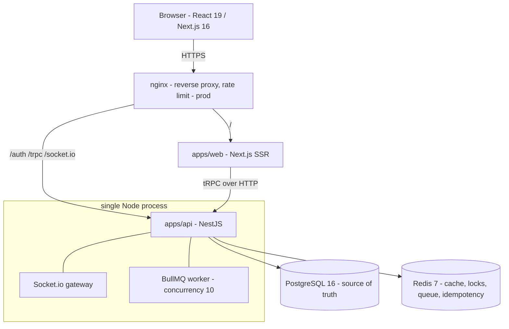

# SeatSure

High-concurrency event ticketing — **zero overselling, proven under load**.

A production grade booking platform with assigned seats and general admission, a
distributed-lock + queue booking pipeline, live seat maps over Socket.io, and
a k6 spike test that sells exactly 400 of 400 seats under 500 concurrent users.

**Live:** https://seatsure-web.vercel.app

## Architecture



- **apps/web** — Next.js 16 (SSR event list, live seat grid, mock checkout);
  type-safe API calls via a type-only tRPC `AppRouter` import.
- **apps/api** — NestJS 11: REST auth (rotating refresh tokens with
  family-reuse revocation), tRPC router, Socket.io gateway and BullMQ worker
  in one long-lived process.
- **packages/shared** — Zod schemas used by web forms, tRPC inputs, and API
  pipes alike.

## Quickstart

```bash
corepack enable            # pnpm 9
cp .env.example apps/api/.env
docker compose up -d       # postgres + redis
pnpm install
pnpm db:migrate && pnpm seed
pnpm dev                   # web :3000, api :3001
```

Seeded logins: `admin@seatsure.dev` / `admin12345`, `organizer@seatsure.dev`
and `user1..20@seatsure.dev` / `password123`.

Prod-like stack (multi-stage images + nginx on port 80):

```bash
docker compose -f docker-compose.prod.yml up --build
```

Tests (real Postgres + Redis): `pnpm --filter @seatsure/api test` — 20 e2e
tests including the five concurrency scenarios. Browser flow:
`pnpm --filter @seatsure/web e2e` (Playwright, stack must be running).

## How overselling is prevented — five defense layers

| # | Layer | Catches |
|---|---|---|
| 1 | Per-seat Redis lock (`SET NX PX` + token-checked release, fail-fast) | Serializes the hot path; contention falls through to the queue |
| 2 | Optimistic version check in the seat `UPDATE` | Lock expiry / stolen-lock edge cases |
| 3 | Conditional `WHERE` (status = AVAILABLE / `remaining_capacity >= qty`) | Any write that slipped past 1–2 |
| 4 | One Prisma transaction around re-read → update → booking → charge → ledger | Partial writes |
| 5 | Partial unique index: one CONFIRMED booking per seat | The database physically cannot store a double booking |

Layer 5 is load-bearing by design: even if every line of application code were
wrong, Postgres rejects the second confirmed booking for a seat.

Contention path: a failed lock acquisition creates a PENDING booking and
enqueues it (BullMQ, 3 attempts, exponential backoff); the outcome is pushed
over Socket.io (`booking-status`) with a polling fallback, and seat maps flip
live via `seat-updated` in under a second.

## Load test (k6 booking spike)

Scenario (`load/booking-spike.js`): ramp 0→100 VUs (30s), spike to 500 VUs
(1m), ramp down (30s); every iteration books a random seat from a pre-seeded
pool of **400 seats** with jittered 1.5–3s think-time. `409 SEAT_TAKEN` is an
expected status under deliberate contention.

Environment: Windows 11, 12 logical cores; single-process API, Postgres 16 +
Redis 7 in Docker Desktop, k6 v2.1.0 on the same machine.
`RATE_LIMIT_BOOKING_MAX` raised for the run (it is a fraud control, not a
capacity control).

### Results — 2026-07-17

| Metric | Threshold | Result |
|---|---|---|
| requests | — | 12,057 (≈99 rps sustained) |
| `http_req_failed` | < 1% | **0.00%** ✓ |
| `http_req_duration` p95 | < 500 ms | **102.28 ms** ✓ |
| median / avg / max | — | 16.9 ms / 29.9 ms / 199 ms |

### Zero-oversell verification (`pnpm --filter @seatsure/api verify:load`)

| Check | Count |
|---|---|
| confirmed bookings | **400** |
| distinct booked seats | **400** |
| seats with status BOOKED | **400** |
| transaction rows | **400** |
| pending bookings left | 0 |

**RESULT: ZERO OVERSELL ✓** — 12,057 spike attempts, exactly 400 seats sold,
one confirmed booking per seat, every confirmed booking has a payment record.


## Payments: the Stripe seam

v1 uses a `MockPaymentProvider` behind the `PAYMENT_PROVIDER` DI token, charged
*inside* the booking transaction (synchronous, in-process, deterministic
failure hook: amounts ending in 99 decline). Swapping in Stripe is:

1. `StripePaymentProvider` bound to the same token (one-line module change).
2. The charge moves *outside* the transaction into a saga:
   book-PENDING → charge → CONFIRM (webhook) / release. The booking service is
   the only file that changes; `/webhooks/payments` is already reserved and
   the idempotency-key plumbing already exists.

## Deploy artifacts

See [DEPLOYMENT.md](./DEPLOYMENT.md) for what's actually running in
production. The repo also carries:

- `apps/api/Dockerfile`, `apps/web/Dockerfile` — multi-stage node:20-alpine,
  non-root, pruned (api 78 MB / web 64 MB compressed).
- `nginx/nginx.conf` — reverse proxy, websocket upgrade, `limit_req` 30 r/m
  burst 20 on API routes; `docker-compose.prod.yml` runs the full prod-like
  stack locally on port 80.
- `.github/workflows/ci.yml` — lint → typecheck → e2e tests against real
  Postgres/Redis services → image builds; deploy job gated behind the
  `DEPLOY_ENABLED` repo variable.
- `deploy/cloud-run.sh` (min-instances 1, session affinity for Socket.io) and
  `apps/web/vercel.json`.
